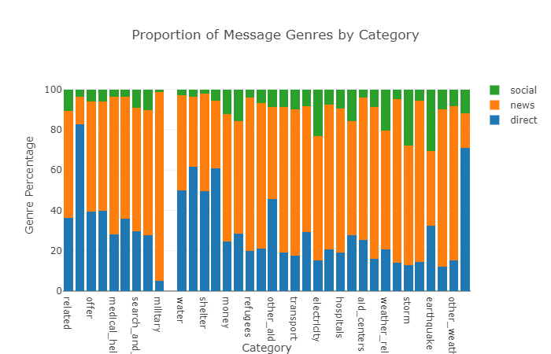

# Disaster Response Pipeline Project

Project to create a web-app to quickly categorize social media messages in a disaster situation for sorting and 
forwarding to relevant aid providers.  

## Instructions:
1. Run the following commands in the project's root directory to set up your database and model.

    - To run ETL pipeline that cleans data and stores in database
        `python data/process_data.py data/disaster_messages.csv data/disaster_categories.csv data/DisasterResponse.db`
    - To run ML pipeline that trains classifier and saves
        `python models/train_classifier.py data/DisasterResponse.db models/classifier.pkl`

2. Run the following command in the app's directory to run your web app.
    `python run.py`

3. Go to http://0.0.0.0:3001/ or http://{hostname}:3001/
   Where {hostname} is the domain name or IP address of your web server.

## Principle of Operation:

Messages are pre-processed for better training in recognition, by changing all letters to lower case, removing 
words such as a, and, any, etc. which contribute little to the information contained int he message, and by transforming
words to root forms (e.g. transforming -> transform). This is done to reduce the number of words the machine learning
pipeline has to deal with to a set that contains the most valuable information.

Messages are classified by counting words and 2-grams (i.e. groups of two words, like "diesel generator", "fresh water") 
and transforming the counts to the TF_IDF measurement. This weights the frequency of occurrence of a word or 2-gram in 
a message by the inverse of how often it occurs in the whole corpus of messages. This ensures that very frequent terms 
are given less importance, since they usually convey less information than infrequent terms.
A multi-categorical random forest classifier is trained on 80% of the original training data set, the remaining 20% are
used to validate the model quality. The trained model is then applied to new messages entered via the web frontend, 
outputting the identified message categories.    

## Properties of the Training Data Set

The training data set consists of about 26000 social media messages collected during disasters. All messages are 
provided in English language, however some are originally in other languages. In some cases, the english messages 
contain the keyword "NOTES:", in which case the translation is not given, but some explanation by the translator, why 
the message is not relevant or cannot be translated. These messages are useless for the training and filtered out during
the import stage. 

Messages are labeled as belonging to one of 3 genres: "direct", "news" and "social", describing the message origin.
Besides this, each for message is labeled whether it pertains to one of 36 emergency or need categories. These labels
for the training targets.

The figure below shows that the proportion between messages originally in English and other languages varies with 
between message categories. This correlation between original language and message category might be used as an
additional training datum. However, the correlation may as well be spurious, e.g. because it is related to the location
of different types of disasters included in the training set. Since the danger of overfitting is very high, I decided
agains using the original language as a factor. 

The figure also shows that the training set is quite imbalanced. A large number of messages are weather related, while
only very few relate to hospitals. The set contains about 4500 aid requests and 117 offers of aid. These imbalances,
while typical of real-world data sets, pose a challenge to machine learning. Ideally, the split between training and 
test data should be stratified according to each category, so ensure that positives and negatives for each category are 
included in both sets. Unfortunately, With the large number of categories, some of which with very low number of 
positives, this is essentially impossible. It must be kept in mind, that the overall transferability of the model
to other data sets is lower for categories with few examples, even if the validation within the given data set gives
good results.

As an interesting side note, it is interesting to look at the correlation between categories and message genres. The
most obvious cases are aid requests and direct requests, which are overwhelmingly received as direct messages. This 
shows that people direct their calls for help directly to some specific recipient of which they expect the best or 
quickest response. 

Curiously, more than 93% of military related messages are from the news genre. It might be interesting to investigate
the origin of this effect.

## Model Performance

The table below lists the model performance for each category. The perfect score for the "child_alone" category
is due to the fact that there are 0 messages with that category. Interestingly the scores for the categories with the
highest message counts, "related", "aid related" and "direct report" are the lowest. This may be related to the 
relatively low number of features and estimators that could be used during training here. With more available compute
capacity, larger models could be trained.

Generally, precision, recall and f1 score are close together, which indicates that the models are not grossly 
overfitted.

Model evaluation
|category                  | f1 score   | precision  | recall     |
|--------------------------|------------|------------|------------|
|related                   |   0.773305 |   0.769145 |   0.793037 |
|request                   |   0.890531 |   0.891745 |   0.898453 |
|offer                     |   0.994781 |   0.993049 |   0.996518 |
|aid_related               |   0.731928 |   0.733825 |   0.735010 |
|medical_help              |   0.892375 |   0.890398 |   0.916248 |
|medical_products          |   0.929852 |   0.932392 |   0.949323 |
|search_and_rescue         |   0.957840 |   0.944678 |   0.971373 |
|security                  |   0.973476 |   0.973524 |   0.982012 |
|military                  |   0.949887 |   0.940708 |   0.965764 |
|child_alone               |   1.000000 |   1.000000 |   1.000000 |
|water                     |   0.956970 |   0.956341 |   0.959961 |
|food                      |   0.937144 |   0.936449 |   0.940232 |
|shelter                   |   0.929203 |   0.930126 |   0.936557 |
|clothing                  |   0.975790 |   0.968143 |   0.983559 |
|money                     |   0.970074 |   0.970632 |   0.978917 |
|missing_people            |   0.982240 |   0.976539 |   0.988008 |
|refugees                  |   0.952708 |   0.951638 |   0.965571 |
|death                     |   0.930603 |   0.939108 |   0.951451 |
|other_aid                 |   0.829783 |   0.837659 |   0.870019 |
|infrastructure_related    |   0.912099 |   0.905152 |   0.938685 |
|transport                 |   0.944038 |   0.944144 |   0.956867 |
|buildings                 |   0.941343 |   0.945419 |   0.953578 |
|electricity               |   0.967530 |   0.967865 |   0.976983 |
|tools                     |   0.992463 |   0.989967 |   0.994971 |
|hospitals                 |   0.985495 |   0.983842 |   0.989942 |
|shops                     |   0.992463 |   0.989967 |   0.994971 |
|aid_centers               |   0.984340 |   0.982568 |   0.989168 |
|other_infrastructure      |   0.940613 |   0.926794 |   0.958994 |
|weather_related           |   0.855326 |   0.859217 |   0.861509 |
|floods                    |   0.945941 |   0.951283 |   0.952805 |
|storm                     |   0.932168 |   0.931149 |   0.936750 |
|fire                      |   0.984360 |   0.979219 |   0.989555 |
|earthquake                |   0.964889 |   0.965215 |   0.966538 |
|cold                      |   0.971752 |   0.962821 |   0.980851 |
|other_weather             |   0.933547 |   0.930230 |   0.951644 |
|direct_report             |   0.836577 |   0.840798 |   0.853772 |
|--------------------------|------------|------------|------------|

It should be noted that the model parameters chosen represent the maximum values for number of estimators and number of
features. This indicated that the whole model is still underfitted. However, the training of larger models would not
have been practicable on the available hardware. For a production environment, the parameter grid should be extended
to larger values. 

### Model optimal parameters
 * number of random forest estimators  :  200
 * maximum number of message features  :  200
 * N-gram range  :  (1, 1)